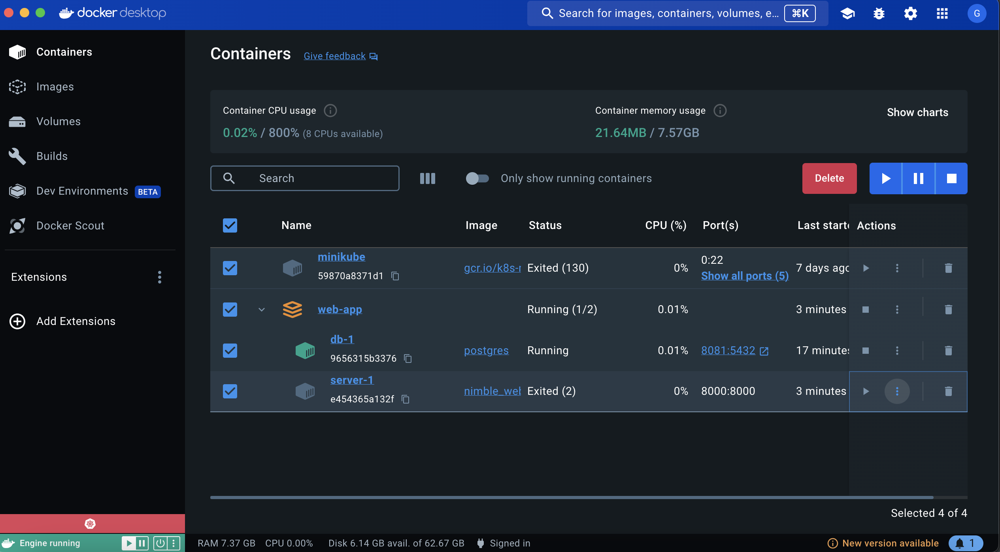
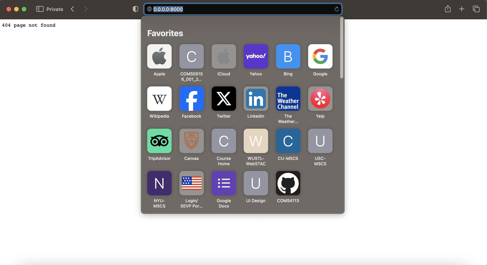
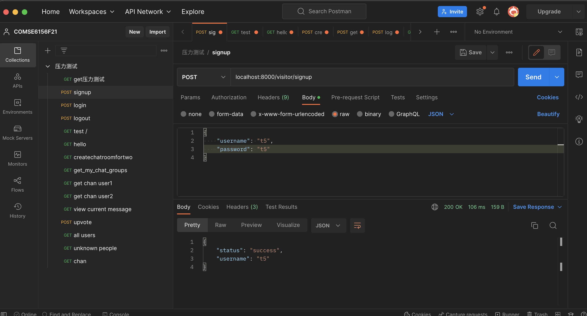
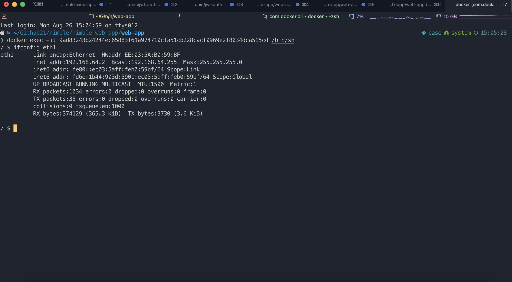
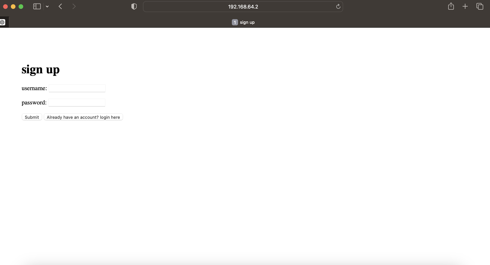

## web app
### run locally
first enter the parent dir of the folder `web-app`, then download all deps
```shell
go get ./... 
```
then you can run the whole project with
```shell
go run *.go
```
After the server is running you can visit `0.0.0.0:8000` to start using this app 

For the authentication and some other simple db queries I chose HTTP. For real-time chat I chose WebSocket.
The backend is written in go with Gin framework. The frontend is written in vanilla JS with JQuery. The WebSocket impl comes from [Melody](https://github.com/olahol/melody) framework.

You can find the running demo vid from the vids folder `./vids/local_running.mp4`

I implement the authentication middleware, transaction middleware (for up/down vote race condition) and a permission middleware to only let the senders and receivers to read their past messages.

For the DB, I chose postgres. Ideally, will use unstructured database (no-sql) for scaling purpose and K-V store might be idea for low latency messages service (to save messages data)

Really do not have too much time for the frontend so the UI looks quite simple.

All db settings are in file `./initializers/connectToDb.go` you need to make sure you have postgre_cluster running locally and will need a user `username=nimble password=nimble` and database `dbname=nimble` or you have to modify this to your default user/pwd/db

## docker run
there are multiple problems when try to deploy using docker

### 1st way
the first partially work solution is as below

first change `./initializers/connectToDb.go` as follow
```go
dsn := "host=172.0.0.4 user=nimble password=nimble dbname=nimble port=5432 sslmode=disable"
```
and modify the `compose.yaml` file as below
```yaml
# Comments are provided throughout this file to help you get started.
# If you need more help, visit the Docker Compose reference guide at
# https://docs.docker.com/go/compose-spec-reference/

# Here the instructions define your application as a service called "server".
# This service is built from the Dockerfile in the current directory.
# You can add other services your application may depend on here, such as a
# database or a cache. For examples, see the Awesome Compose repository:
# https://github.com/docker/awesome-compose
services:
  server:
    image: nimble_web_app:Dockerfile
    build:
      context: .
      target: final
      network: "host"
    ports:
      - 8000:8000
    expose:
      - 8000
#    network_mode: "host"
    depends_on:
      - db
    networks:
      vpcbr:
        ipv4_address: 172.0.0.3
  db:
    image: postgres
    restart: always
    # set shared memory limit when using docker-compose
    shm_size: 128mb
    # or set shared memory limit when deploy via swarm stack
    #volumes:
    #  - type: tmpfs
    #    target: /dev/shm
    #    tmpfs:
    #      size: 134217728 # 128*2^20 bytes = 128Mb
    environment:
      POSTGRES_PASSWORD: nimble
      POSTGRES_USER: nimble
      POSTGRES_DB: nimble
    networks:
      vpcbr:
        ipv4_address: 172.0.0.4
    expose:
      - 5432
    ports:
      - 8081:5432

networks:
  vpcbr:
    driver: bridge
    ipam:
      config:
        - subnet: 172.0.0.0/16
          gateway: 172.0.0.1
```
here we use static ips, after running
```shell
docker build -t "nimble_web_app:Dockerfile" . 
```
to build the image, run
```shell
docker-compose start [/OR] docker-compose up server
```
you can check that the server is running on docker

The weird thing is all the static served files will not work under this situation
but all dynamic handlers will work

*static pages not work*


*dynamic pages work*


### 2nd way
do not use static ip, first change `./initializers/connectToDb.go`
```go
dsn := "host=0.0.0.0 user=nimble password=nimble dbname=nimble port=8081 sslmode=disable"
```
then change `compose.yaml`
```yaml
# Comments are provided throughout this file to help you get started.
# If you need more help, visit the Docker Compose reference guide at
# https://docs.docker.com/go/compose-spec-reference/

# Here the instructions define your application as a service called "server".
# This service is built from the Dockerfile in the current directory.
# You can add other services your application may depend on here, such as a
# database or a cache. For examples, see the Awesome Compose repository:
# https://github.com/docker/awesome-compose
services:
  server:
    image: nimble_web_app:Dockerfile
    build:
      context: .
      target: final
      network: "host"
    ports:
      - 8000:8000
    expose:
      - 8000
    network_mode: "host"
    depends_on:
      - db
  db:
    image: postgres
    restart: always
    # set shared memory limit when using docker-compose
    shm_size: 128mb
    # or set shared memory limit when deploy via swarm stack
    #volumes:
    #  - type: tmpfs
    #    target: /dev/shm
    #    tmpfs:
    #      size: 134217728 # 128*2^20 bytes = 128Mb
    environment:
      POSTGRES_PASSWORD: nimble
      POSTGRES_USER: nimble
      POSTGRES_DB: nimble
    expose:
      - 5432
    ports:
      - 8081:5432
```
then run docker build and docker compose the same as `1st way`
in this way we need to first log in to the container to find the inner ip, in my case it is as below

then you can access the app through this ip

Same as `1st way` all static pages won't work but dynamic pages will work

You can check `/vids/docker_run.mp4` for more details

### 3rd try
The static file problems have been solved by change dockerfile and do copy from local repo to the image

the updated dockerfile will be
```Dockerfile
# syntax=docker/dockerfile:1

FROM --platform=$BUILDPLATFORM golang:1.23.0 AS build
COPY ./templates /src/templates

WORKDIR /src

RUN --mount=type=cache,target=/go/pkg/mod/ \
    --mount=type=bind,source=go.sum,target=go.sum \
    --mount=type=bind,source=go.mod,target=go.mod \
    go mod download -x


ARG TARGETARCH

RUN --mount=type=cache,target=/go/pkg/mod/ \
    --mount=type=bind,target=. \
    CGO_ENABLED=0 GOARCH=$TARGETARCH go build -o /bin/server .

EXPOSE 8000
EXPOSE 5432

ENTRYPOINT [ "/bin/server" ]
```
After doing this we rebuild the image as `2nd way` and change codes as `2nd way`. Then we can now find the static pages are also working

Another recording of this working example is `./vids/docker_run2.mp4` 

### notes
after trying docker to get back to local env, change `./initializers/connectToDb.go` as below
```go
dsn := "host=0.0.0.0 user=nimble password=nimble dbname=nimble port=5432 sslmode=disable"
```

